### Hi there 👋 I'm Chengyang (Kevin) Li

**Robotics researcher** focusing on **robot infra & tooling** — building reliable systems that support researchers to do better robotics.

Currently doing research at **HKU** and **INVS Lab @ SIAT**, working on:
- Robot navigation and motion planning
- Autonomous driving datasets & simulation (e.g. CARLA)
- Robotics infrastructure: reusable codebases, experiment pipelines, deployment

I also run **Hive Matrix**, a robotics company focusing on robot sales and related services, and an official reseller of **AgileX**, **Unitree**, and **Astribot**.

- **Engineering focus**: building robust robotics infrastructure (navigation stacks, dataset/simulation tooling, experiment pipelines)
- **Tools I use**: **C++**, **Python**, **ROS / ROS 2**, **Docker**, Linux, Git

📫 **Contact**: [kevinladlee__at__gmail_com](mailto:kevinladlee__at__gmail_com)  
🤝 **Hive Matrix sales**: [sales@hive-matrix.com](mailto:sales@hive-matrix.com)